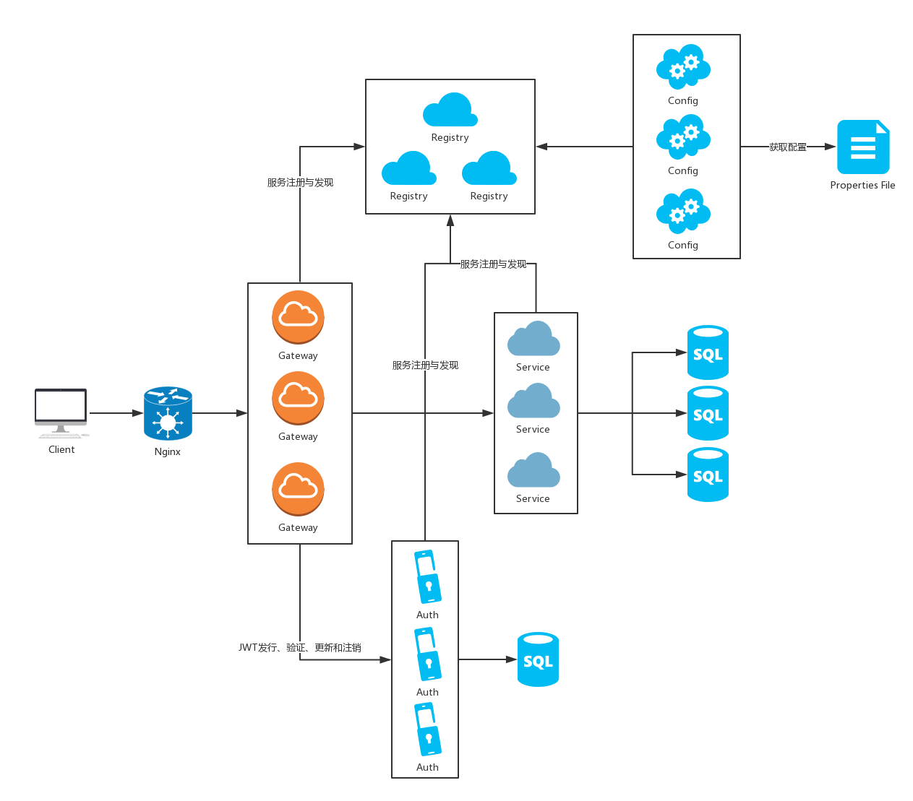
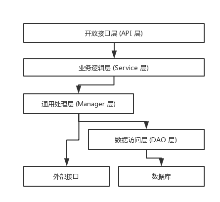

# QBC框架

## 内容概览

* [技术选型](#技术选型)
* [系统架构](#系统架构)
* [框架模块](#框架模块)
    * [注册中心](#注册中心)
    * [配置中心](#配置中心)
    * [认证中心](#认证中心)
    * [网关中心](#网关中心)
* [应用分层](#应用分层)
* [框架说明](#框架说明)
    * [开放接口](#开放接口)
    * [数据访问](#数据访问)
    * [多数据源](#多数据源)
    * [代码生成](#代码生成)
    * [Redis](#Redis)
    * [消息队列](#消息队列)
    * [定时任务](#定时任务)
    * [参数校验](#参数校验)
    * [国际化](#国际化)
    * [日志](#日志)
    * [邮件](#邮件)
    * [SFTP](#SFTP)
    * [系统参数](#系统参数)
    * [数据字段](#数据字段)
* [参考资料](#参考资料)
    * [开源项目](#开源项目)
    * [技术博客](#技术博客)

## <a name="技术选型"></a>技术选型

技术|名称|URL
--|--|--
Spring Framework|容器|[https://spring.io/projects/spring-framework](https://spring.io/projects/spring-framework)
Spring Boot|脚手架|[https://spring.io/projects/spring-boot](https://spring.io/projects/spring-boot)
Spring Data JPA|JPA|[https://spring.io/projects/spring-data-jpa](https://spring.io/projects/spring-data-jpa)
dynamic-datasource-spring-boot-starter|动态多数据源|[https://github.com/baomidou/dynamic-datasource-spring-boot-starter](https://github.com/baomidou/dynamic-datasource-spring-boot-starter)
spring-data-jpa-extra|JPA扩展|[https://github.com/slyak/spring-data-jpa-extra](https://github.com/slyak/spring-data-jpa-extra)
Spring Data Redis|Redis|[https://spring.io/projects/spring-data-redis](https://spring.io/projects/spring-data-redis)
Java JWT|JWT|[https://github.com/auth0/java-jwt](https://github.com/auth0/java-jwt)
Spring Cloud|微服务|[https://spring.io/projects/spring-cloud](https://spring.io/projects/spring-cloud)
p3c|阿里巴巴Java开发手册和Eclipse插件|[https://github.com/alibaba/p3c](https://github.com/alibaba/p3c)

## <a name="系统架构"></a>系统架构



## <a name="框架模块"></a>框架模块

```
qbc
├── qbc-cloud -- 微服务框架
|    ├──qbc-cloud-auth -- 认证中心
|    ├──qbc-cloud-config -- 配置中心
|    ├──qbc-cloud-gateway -- 网关中心
|    ├──qbc-cloud-registry -- 注册中心
|    ├──qbc-cloud-starter -- 微服务脚手架
├── qbc-starter -- 普通服务脚手架
├── qbc-starter-data -- 数据访问服务脚手架
```

### <a name="注册中心"></a>注册中心

通过 Spring Cloud Netflix Eureka 实现注册中心。提供服务的注册于发现功能。生产环境中采用3个对等节点进行两两注册以实现高可用。

### <a name="配置中心"></a>配置中心

通过 Spring Cloud Config 实现配置中心。配置中心注册到注册中心。在生产环境中服务从配置中心读取文件，而配置中心从 Git 读取配置文件，将配置中心做成一个集群化微服务即可实现高可用，满足大量服务的需求。

### <a name="认证中心"></a>认证中心

通过 JWT 实现认证中心。提供 Token 的发行、验证和失效功能。在验证 Token 的时候，也对权限进行验证。

### <a name="网关中心"></a>网关中心

通过 Spring Cloud Gateway 实现网关中心。提供外部的统一访问入口。收到外部请求后，如果是 Token 的发行或失效，会直接分发到认证中心。如果是对其他服务的请求，会先到认证中心进行 Token 和权限的验证，如果通过验证，才会分发到对应的服务。

## <a name="应用分层"></a>应用分层

- **开放接口层 (API 层)**

    - 通过注解的形式，直接封装 Service 方法暴露成 RPC 接口；

    - 通过注解的形式，验证请求参数，统一处理异常，封装返回结果。

- **业务逻辑层 (Service 层)**

    - 通过调用 Manager 层或 DAO 层实现对业务逻辑和流程的控制。

- **通用处理层 (Manager 层)** 

    - 使用 DTO (Data Transfer Object) 向上层传输对象；

    - 对第三方平台封装的层，预处理返回结果及转化异常信息；

    - 对 Service 层通用能力的下沉，如缓存方案、中间件通用处理；

    - 与 DAO 层交互，对多个 DAO 的组合复用。

- **数据访问层 (DAO 层)** 

    - 使用 DO (Data Object) 向上层传输对象；

    - 与底层数据库进行交互。



## <a name="框架说明"></a>框架说明

### <a name="开放接口"></a>开放接口

所有的开放接口，拥有统一的请求和响应格式。

- **请求** 

参数名|参数表示名|参数类型|是否必须
--|--|--|--
apiName|API名|String|是
operationName|API操作名|String|是
params|API参数|Object|否

``` json
{
    "apiName": "applicationService",
    "operationName": "info",
    "params": {}
}
```

- **响应** 

参数名|参数表示名|参数类型|是否必须
--|--|--|--
code|响应编码|int|是
message|响应信息|String|是
data|响应内容|Object|否

``` json
{
    "code": 0,
    "message": "ok",
    "data": {}
}
```

- **响应编码** 

框架定义了以下的共通响应编码。业务模块可以返回自定义的响应编码。

编码值|编码名称|描述
--|--|--
0|正常|请求成功。
1|请求错误|请求内容和接口规范不符，需要按照响应信息和接口规范修改后重新请求。
2|认证错误|没有授权或者没有通过认证，需要获得授权和通过认证才能访问。
3|熔断|请求的服务暂时无法访问，需要等待服务恢复后重试。
4|系统错误|发生预料外的异常，需要联系技术担当修复。

### <a name="数据访问"></a>数据访问

普通的 CRUD 可以使用 JPA ，复杂的 SQL 可以给 JPA 方法加上 @TemplateQueryz 注解，并把 SQL 语句写在 src/main/resources/sqls/实体名.sftl 文件中。

``` java
@TemplateQuery
List<SysRoleDO> searchByUsername(String username);
```

``` sql
--searchByUsername
select
	sys_role.id,
	sys_role.created_by,
	sys_role.created_date_time,
	sys_role.last_modified_by,
	sys_role.last_modified_date_time,
	sys_role.deleted,
	sys_role."name",
	sys_role.display_name,
	sys_role.description
from
	sys_role
join sys_user_role on
	sys_user_role.role_id = sys_role.id
	and sys_user_role.deleted = false
	and sys_role.deleted = false
join sys_user on
	sys_user.id = sys_user_role.user_id
	and sys_user.deleted = false
where
	sys_user.username = :username

```

对于 DO 对象，框架提供了抽象的父类，用于封装数据库共通的字段，并自动设值。

字段名|字段表示名|字段类型|描述
--|--|--|--
id|ID|Long|主键。插入到数据库时，自动设置分布式 SnowFlake ID。
createdBy|创建者|Long|插入到数据库时，自动设置当前请求的用户ID。
createdDateTime|创建时间|LocalDateTime|插入到数据库时，自动设置当前时间。
lastModifiedBy|最后更新者|Long|插入和更新到数据库时，自动设置当前请求的用户ID。
lastModifiedDateTime|最后更新时间|LocalDateTime|插入和更新到数据库时，自动设置当前时间。
deleted|已删除|Boolean|逻辑删除时，手动设置true。

### <a name="多数据源"></a>多数据源

### <a name="代码生成"></a>代码生成

### <a name="Redis"></a>Redis

### <a name="消息队列"></a>消息队列

### <a name="定时任务"></a>定时任务

### <a name="参数校验"></a>参数校验

### <a name="国际化"></a>国际化

### <a name="日志"></a>日志

### <a name="邮件"></a>邮件

### <a name="SFTP"></a>SFTP

### <a name="系统参数"></a>系统参数

### <a name="数据字段"></a>数据字段

## <a name="参考资料"></a>参考资料

### <a name="开源项目"></a>开源项目

- [[分布式敏捷开发系统架构] zheng](https://github.com/shuzheng/zheng)

- [[云框架]基于 Spring Cloud 的微服务架构-用户指南](https://github.com/cloudframeworks-springcloud/user-guide-springcloud)

### <a name="技术博客"></a>技术博客

- [程序员你为什么这么累](https://xwjie.github.io/rule/)


